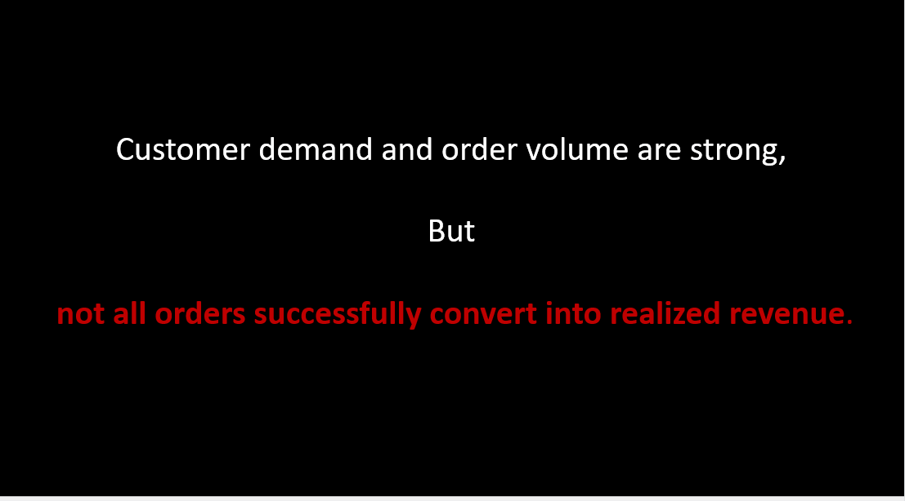
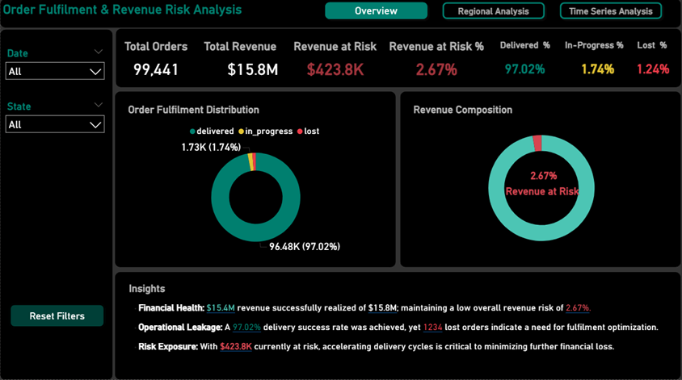
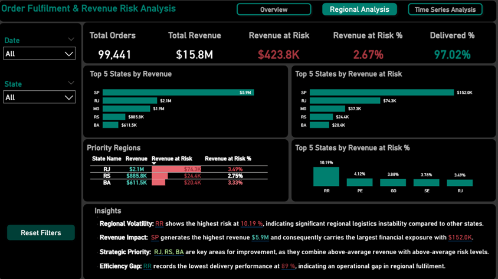
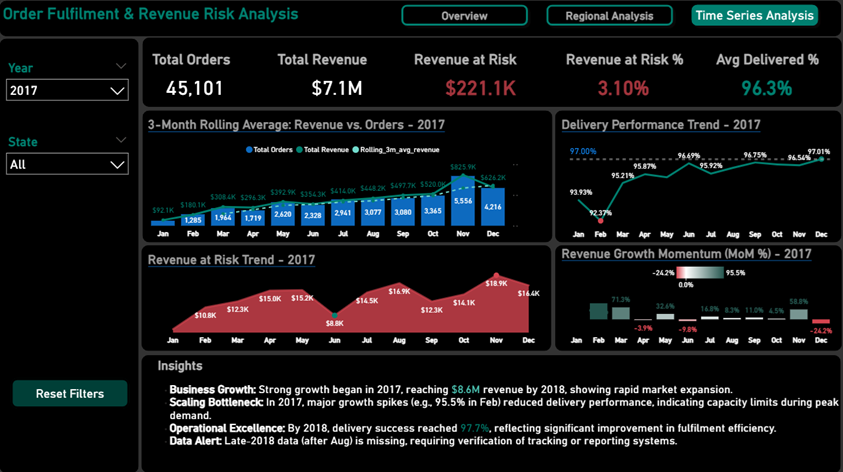
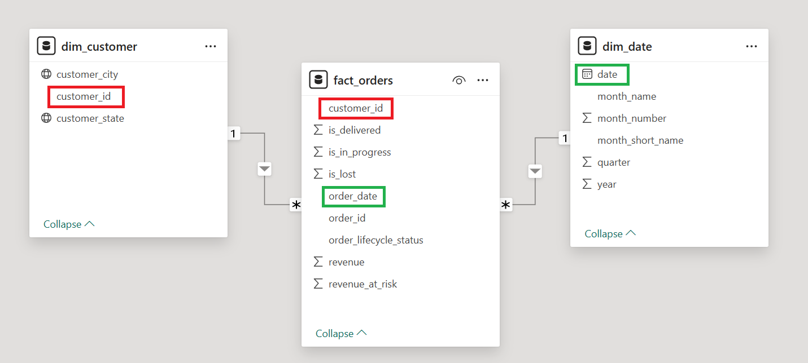

<div dir="rtl" align = "justify">

# 📦 تحلیل عملکرد انجام سفارش‌ها و ریسک درآمد 

### *تحلیل داده سرتاسری: تبدیل داده با SQL + مدل‌سازی Star Schema + داشبوردهای Power BI*

**عملکرد انجام سفارش‌ها | تحلیل ریسک درآمد | بینش‌های منطقه‌ای و روندهای زمانی**


---

<div align="center">



</div>

---

## 🔹 معرفی پروژه

این پروژه عملکرد انجام و تحویل سفارش‌ها را در یک پلتفرم تجارت الکترونیک بررسی می‌کند و نشان می‌دهد چه بخشی از سفارش‌ها در نهایت به درآمد واقعی تبدیل می‌شوند.

هدف پروژه فقط گزارش فروش نیست؛ بلکه بررسی این است که کجای فرآیند انجام سفارش دچار مشکل می‌شود و چطور همین مشکلات باعث می‌شوند بخشی از درآمد بالقوه هرگز محقق نشود.

در ابتدا، داده‌های خام با استفاده از فرآیند ETL مبتنی بر SQL پاک‌سازی و آماده‌سازی شدند. سپس داده‌ها در قالب یک مدل Star Schema سازمان‌دهی شدند تا تحلیل KPIها، ریسک عملیاتی و روندهای زمانی و منطقه‌ای دقیق‌تر انجام شود. در نهایت، نتایج در داشبوردهای تعاملی Power BI نمایش داده شده‌اند تا مدیران و ذی‌نفعان بتوانند سریع‌تر وضعیت سفارش‌ها، درآمد و ریسک‌های عملیاتی را بررسی کنند.

یافته‌های تحلیل نشان می‌دهد که اگرچه نرخ تحویل سفارش‌ها حدود ۹۷٪ است، اما بخشی از درآمد به دلیل سفارش‌های از دست رفته یا در حال پردازش همچنان در معرض ریسک قرار دارد. برای تحلیل این موضوع، از مفهوم Revenue at Risk استفاده شده است تا مشخص شود کدام سفارش‌ها و مناطق بیشترین ریسک را برای تحقق درآمد ایجاد می‌کنند.

در واقع، هر سفارشی لزوماً به درآمد واقعی تبدیل نمی‌شود. تمرکز اصلی این تحلیل روی همین شکاف است: سفارش‌هایی که ثبت شده‌اند، اما به دلیل مشکلات عملیاتی هنوز به درآمد قطعی تبدیل نشده‌اند.

---

## 📸 نمای کلی داشبوردها

### 1️⃣ نمای کلی

<div align="center">



</div>

### 2️⃣ تحلیل منطقه‌ای

<div align="center">



</div>

### 3️⃣ تحلیل زمانی

<div align="center">



</div>

---

## 🌟 خلاصه مدیریتی

در این پروژه، **۹۹٬۴۴۱ سفارش تجارت الکترونیک** تحلیل شده‌اند تا عملکرد فرآیند **انجام و تحویل سفارش‌ها (Order Fulfilment)** ارزیابی شود و میزان **درآمد در معرض ریسک** در چرخه تحویل شناسایی گردد.

نتایج نشان می‌دهد که سیستم انجام سفارش در مجموع عملکرد مطلوبی دارد و **نرخ موفقیت تحویل برابر با ۹۷٫۰۲٪** است. با این حال، بخشی از سفارش‌ها همچنان حل‌نشده یا از دست‌رفته باقی می‌مانند و در نتیجه حدود **۴۲۳٫۸ هزار دلار از درآمد کل، معادل ۲٫۶۷٪** در معرض ریسک قرار دارد. اگرچه این درصد کوچک به نظر می‌رسد، اما در مقیاس تجارت الکترونیک همین موارد کوچک هم می‌توانند به اثر مالی قابل توجهی تبدیل شوند.

تحلیل منطقه‌ای نشان می‌دهد ایالت **Roraima (RR)** بالاترین ریسک عملیاتی نسبی را دارد. این موضوع می‌تواند نشانه‌ای از محدودیت‌های احتمالی لجستیکی یا چالش‌های تحویل در این منطقه باشد.

به طور کلی، یافته‌ها نشان می‌دهد که **پایش هدفمند مناطق پرریسک و سفارش‌های حل‌نشده** می‌تواند به حفاظت از درآمد و بهبود کارایی عملیاتی در کل زنجیره انجام سفارش کمک کند.

---

## 🎯  مسئله کسب‌وکار و اهداف 

با وجود تقاضای بالا و حجم قابل توجه سفارش‌ها، **همه سفارش‌ها به درآمد تحقق‌یافته تبدیل نمی‌شوند**.  
مشکلات عملیاتی در فرآیند انجام سفارش — مانند **سفارش‌های گمشده یا سفارش‌هایی که همچنان در وضعیت در حال پردازش باقی می‌مانند** — باعث ایجاد شکاف میان **درآمد ثبت‌شده** و **درآمدی که واقعاً از طریق تحویل موفق سفارش‌ها محقق می‌شود** می‌گردد.

این ناکارآمدی‌های عملیاتی باعث می‌شود بخشی از درآمد بالقوه کسب‌وکار در معرض ریسک قرار گیرد و میزان درآمد واقعی تحقق‌یافته کاهش یابد.

هدف کسب‌وکار: **بهبود تحقق درآمد از طریق شناسایی گلوگاه‌های عملیاتی در فرآیند انجام سفارش و کاهش میزان درآمد در معرض ریسک.**

---

## ❓ پرسش‌های کلیدی کسب‌وکار

این پروژه تلاش می‌کند به چند پرسش اصلی پاسخ دهد:

- چند درصد از سفارش‌های ثبت‌شده با موفقیت تحویل داده می‌شوند؟
- چه مقدار از درآمد ثبت‌شده هنوز به درآمد واقعی و قطعی تبدیل نشده است؟
- بیشترین درآمد از کدام مناطق می‌آید و ریسک عملیاتی بیشتر در کدام مناطق دیده می‌شود؟
- کدام وضعیت‌های سفارش، بیشترین سهم را در Revenue at Risk دارند؟
- آیا روندهای زمانی نشان‌دهنده افزایش یا کاهش ریسک درآمد هستند؟
- کدام مناطق یا مراحل عملیاتی باید در اولویت بهبود قرار بگیرند؟

---

## 🔍 بینش‌های کلیدی
<div dir="rtl" align="center">
  <table style="width: 100%; border-collapse: collapse; text-align: right; border: 1px solid #ddd;">
    <thead>
      <tr style="background-color: #f2f2f2;">
        <th style="padding: 12px; border: 1px solid #ddd; width: 28%;">بینش</th>
        <th style="padding: 12px; border: 1px solid #ddd; width: 37%;">مشاهده / علت احتمالی</th>
        <th style="padding: 12px; border: 1px solid #ddd; width: 35%;">تأثیر بر کسب‌وکار</th>
      </tr>
    </thead>
    <tbody>
      <tr>
        <td style="padding: 10px; border: 1px solid #ddd;">۹۷٫۰۲٪ از سفارش‌ها با موفقیت تحویل داده می‌شوند</td>
        <td style="padding: 10px; border: 1px solid #ddd;">عملکرد کلی فرآیند انجام سفارش در پلتفرم قوی و پایدار است</td>
        <td style="padding: 10px; border: 1px solid #ddd;">عملیات اصلی کسب‌وکار به طور کلی پایدار بوده و توانایی پاسخ‌گویی به تقاضای مشتریان را دارد</td>
      </tr>
      <tr>
        <td style="padding: 10px; border: 1px solid #ddd;">حدود ۴۲۳٫۸ هزار دلار از درآمد به عنوان <strong>درآمد در معرض ریسک (Revenue at Risk)</strong> طبقه‌بندی شده است (۲٫۶۷٪)</td>
        <td style="padding: 10px; border: 1px solid #ddd;">بخشی از سفارش‌ها همچنان در وضعیت در حال پردازش باقی مانده یا از دست رفته‌اند و مانع تحقق کامل درآمد می‌شوند</td>
        <td style="padding: 10px; border: 1px solid #ddd;">بهبود فرآیندهای عملیاتی می‌تواند مستقیماً بخشی از این درآمد در معرض ریسک را بازیابی کند</td>
      </tr>
      <tr>
        <td style="padding: 10px; border: 1px solid #ddd;">حدود ۲٫۹۸٪ از سفارش‌ها تحویل داده نشده‌اند (سفارش‌های گمشده یا در حال پردازش)</td>
        <td style="padding: 10px; border: 1px solid #ddd;">این سفارش‌ها شکافی میان درآمد ثبت‌شده و درآمد تحقق‌یافته ایجاد می‌کنند</td>
        <td style="padding: 10px; border: 1px solid #ddd;">حتی درصد کوچکی از شکست‌های عملیاتی می‌تواند در مقیاس بزرگ به ریسک مالی قابل توجهی تبدیل شود</td>
      </tr>
      <tr>
        <td style="padding: 10px; border: 1px solid #ddd;">درآمد در چند ایالت کلیدی مانند <strong>SP، RJ و MG</strong> متمرکز است</td>
        <td style="padding: 10px; border: 1px solid #ddd;">بخش عمده فروش از تعداد محدودی منطقه جغرافیایی حاصل می‌شود</td>
        <td style="padding: 10px; border: 1px solid #ddd;">مشکلات عملیاتی در این مناطق می‌تواند تأثیر مالی نامتناسب و قابل توجهی بر کل کسب‌وکار داشته باشد</td>
      </tr>
      <tr>
        <td style="padding: 10px; border: 1px solid #ddd;">ایالت <strong>São Paulo (SP)</strong> بیشترین درآمد و همچنین بیشترین میزان مطلق درآمد در معرض ریسک را دارد</td>
        <td style="padding: 10px; border: 1px solid #ddd;">حجم بالای فروش باعث می‌شود هر کاهش در عملکرد تحویل، ریسک مالی بیشتری ایجاد کند</td>
        <td style="padding: 10px; border: 1px solid #ddd;">بهبود عملکرد تحویل در SP می‌تواند به طور قابل توجهی ریسک کل درآمد را کاهش دهد</td>
      </tr>
      <tr>
        <td style="padding: 10px; border: 1px solid #ddd;">ایالت <strong>Roraima (RR)</strong> بالاترین ریسک عملیاتی نسبی را نشان می‌دهد</td>
        <td style="padding: 10px; border: 1px solid #ddd;">فاصله جغرافیایی و محدودیت‌های احتمالی زیرساخت لجستیکی باعث شده حدود <strong>۱۰٫۱۹٪ از درآمد</strong> در این منطقه در معرض ریسک قرار گیرد</td>
        <td style="padding: 10px; border: 1px solid #ddd;">فرآیندهای لجستیکی و عملیاتی در مناطق کوچک‌تر نیازمند بهبودهای هدفمند هستند</td>
      </tr>
      <tr>
        <td style="padding: 10px; border: 1px solid #ddd;">روند ماهانه درآمد در طول سال ۲۰۱۷ رشد تدریجی را نشان می‌دهد</td>
        <td style="padding: 10px; border: 1px solid #ddd;">تقاضای مشتریان در طول سال افزایش یافته است</td>
        <td style="padding: 10px; border: 1px solid #ddd;">کسب‌وکار دارای تقاضای بازار قوی و پتانسیل رشد قابل توجه است</td>
      </tr>
      <tr>
        <td style="padding: 10px; border: 1px solid #ddd;">عملکرد تحویل سفارش در طول ماه‌ها نوسان دارد</td>
        <td style="padding: 10px; border: 1px solid #ddd;">ظرفیت عملیاتی همیشه همگام با افزایش تقاضا مقیاس‌پذیر نبوده است</td>
        <td style="padding: 10px; border: 1px solid #ddd;">پایش دقیق عملکرد انجام سفارش در دوره‌های اوج تقاضا برای حفظ کیفیت خدمات ضروری است</td>
      </tr>
    </tbody>
  </table>
</div>

---

## 📊 نمای کلی شاخص‌های کلیدی عملکرد (KPI)

- **کل درآمد:** ۱۵٫۸ میلیون دلار  
- **تعداد کل سفارش‌ها:** ۹۹٬۴۴۱  
- **سفارش‌های تحویل‌شده:** ۹۶٬۴۸۱  
- **نرخ تحویل موفق:** ۹۷٫۰۲٪  
- **سفارش‌های از دست‌رفته:** ۱٬۲۳۵  
- **نرخ سفارش‌های از دست‌رفته:** ۱٫۲۴٪  
- **نرخ سفارش‌های در حال پردازش:** ۱٫۷۴٪  
- **درآمد تحقق‌یافته:** حدود ۱۵٫۳۸ میلیون دلار  
- **درآمد در معرض ریسک:** ۴۲۳٫۸ هزار دلار (۲٫۶۷٪)

 بخش عمده سفارش‌ها با موفقیت تحویل داده می‌شوند که منجر به تحقق قابل توجه درآمد شده است. با این حال، سهم کوچکی از سفارش‌های از دست‌رفته یا در حال پردازش باعث شده **۴۲۳٫۸ هزار دلار از درآمد در معرض ریسک عملیاتی قرار گیرد**؛ موضوعی که نشان‌دهنده فرصت‌هایی برای بهینه‌سازی فرآیند انجام سفارش است.

---

### 🚀 اقدامات راهبردی

<div align="center">

<table dir="rtl">
  <thead>
    <tr>
      <th style="text-align: center;">اقدام</th>
      <th style="text-align: center;">میزان تأثیر</th>
      <th style="text-align: center;">میزان تلاش موردنیاز</th>
      <th style="text-align: center;">اولویت</th>
    </tr>
  </thead>
  <tbody>
    <tr>
      <td>بهبود پایش فرآیند انجام سفارش در ایالت‌های با درآمد بالا <span dir="rtl">(به‌ویژه <span dir="ltr">SP</span>)</span></td>
      <td align="center">زیاد</td>
      <td align="center">متوسط</td>
      <td align="center"><b>بالا</b></td>
    </tr>
    <tr>
      <td>بررسی و تحلیل مشکلات لجستیکی در مناطق پرریسک مانند <span dir="ltr">RR</span> که قابلیت اطمینان تحویل در آن‌ها کمتر از میانگین ملی است</td>
      <td align="center">زیاد</td>
      <td align="center">متوسط</td>
      <td align="center"><b>بالا</b></td>
    </tr>
    <tr>
      <td>اولویت دادن به بهبودهای عملیاتی در ایالت‌هایی که هم درآمد بالا و هم ریسک بالا دارند <span dir="rtl">(مانند <span dir="ltr">RJ</span>، <span dir="ltr">RS</span> و <span dir="ltr">BA</span>)</span></td>
      <td align="center">زیاد</td>
      <td align="center">متوسط</td>
      <td align="center"><b>بالا</b></td>
    </tr>
    <tr>
      <td>پایش دقیق و حل سریع سفارش‌های در حال پردازش برای جلوگیری از تبدیل آن‌ها به سفارش‌های از دست‌رفته</td>
      <td align="center">متوسط</td>
      <td align="center">کم</td>
      <td align="center"><b>بالا</b></td>
    </tr>
    <tr>
      <td>استفاده از شاخص‌های منطقه‌ای انجام سفارش (مانند نرخ تحویل و درآمد در معرض ریسک) به‌عنوان شاخص‌های عملکرد عملیاتی</td>
      <td align="center">متوسط</td>
      <td align="center">کم</td>
      <td align="center">متوسط</td>
    </tr>
    <tr>
      <td>تقویت برنامه‌ریزی عملیاتی در ماه‌های با تقاضای بالا برای حفظ عملکرد تحویل همزمان با افزایش حجم سفارش</td>
      <td align="center">متوسط</td>
      <td align="center">متوسط</td>
      <td align="center">متوسط</td>
    </tr>
  </tbody>
</table>

</div>

---

## 📈 تأثیر مورد انتظار بر کسب‌وکار

اجرای پیشنهادهای این تحلیل می‌تواند نتایج زیر را برای کسب‌وکار به همراه داشته باشد:

- کاهش درآمد در معرض ریسک از طریق شناسایی زودهنگام سفارش‌های مسئله‌دار
- بهبود نرخ تحویل و کاهش سفارش‌های ناموفق یا طولانی‌مدت
- افزایش شفافیت در وضعیت تحقق درآمد
- کمک به مدیران برای تصمیم‌گیری سریع‌تر درباره مناطق یا فرآیندهای پرریسک
- بهبود تجربه مشتری از طریق کاهش تأخیر، لغو یا گم‌شدن سفارش‌ها
- استفاده بهتر از داده‌های عملیاتی برای تصمیم‌گیری مالی و لجستیکی

---

## 🔎 مهم‌ترین نکات تحلیلی

- **درآمد در معرض ریسک:** با وجود عملکرد قوی در تحویل سفارش‌ها (۹۷٫۰۲٪)، حدود **۴۲۳٫۸ هزار دلار از درآمد** به دلیل سفارش‌های از دست‌رفته یا در حال پردازش همچنان در معرض ریسک قرار دارد.  
- **تمرکز منطقه‌ای درآمد:** بخش قابل توجهی از درآمد در ایالت‌های **SP، RJ و MG** متمرکز است؛ بنابراین عملکرد عملیاتی در این مناطق تأثیر مستقیمی بر تحقق کل درآمد دارد.  
- **ریسک مطلق بالا:** ایالت **SP** بیشترین درآمد را ایجاد می‌کند و در نتیجه، در صورت افت عملکرد تحویل، بیشترین میزان ریسک مطلق درآمد نیز در همین منطقه دیده می‌شود.  
- **ریسک نسبی بالا:** ایالت **RR** بالاترین درصد درآمد در معرض ریسک را دارد و نرخ تحویل آن نیز پایین‌تر از میانگین ملی است. این موضوع می‌تواند نشان‌دهنده ناکارآمدی‌های احتمالی در فرآیند لجستیک باشد.  
- **رشد تقاضا:** روند درآمد در سال **۲۰۱۷** رشد تدریجی و پایدار را نشان می‌دهد که بیانگر افزایش تقاضای مشتریان و گسترش بازار است.  
- **پایداری عملیاتی:** نوسانات ماهانه در نرخ تحویل نشان می‌دهد که ظرفیت عملیاتی همیشه هم‌زمان با رشد تقاضا افزایش پیدا نکرده است، به‌ویژه در ماه‌هایی که حجم سفارش‌ها بالاتر بوده است.

---

## 🧩 مدل داده‌ای

مدل داده‌ای این پروژه بر اساس معماری **Star Schema** طراحی شده است تا تحلیل‌های تجاری سریع، شفاف و مقیاس‌پذیر در Power BI امکان‌پذیر باشد. در این ساختار، جدول **fact_orders** در مرکز قرار دارد و اطلاعات تراکنش‌های سفارش را نگهداری می‌کند. در اطراف آن، جداول ابعادی **dim_customer** و **dim_date** قرار دارند که به ترتیب اطلاعات مشتری و زمان را ارائه می‌دهند.

ارتباط بین جداول به صورت **Many-to-One** تعریف شده است؛ به این معنا که هر رکورد در جدول **fact_orders** به یک رکورد در جداول ابعادی مرتبط می‌شود. همچنین جهت فیلترگذاری در مدل به صورت **Single Direction Filtering** تنظیم شده است تا از ایجاد مسیرهای فیلترینگ پیچیده جلوگیری شود و عملکرد داشبورد در Power BI بهینه باقی بماند.

این ساختار داده‌ای باعث می‌شود محاسبه شاخص‌های کلیدی عملکرد (KPI) ساده‌تر، سریع‌تر و قابل اعتمادتر انجام شود. همچنین امکان تحلیل‌های چندبعدی مانند بررسی روندهای زمانی، مقایسه عملکرد مناطق مختلف و ارزیابی **Revenue at Risk** را با دقت بیشتری فراهم می‌کند.

<p align="center">



<P>

---
<div dir="rtl" style="text-align: right;">

### ⚙️ فرآیند ETL و تبدیل داده مبتنی بر SQL

در این پروژه، آماده‌سازی داده‌ها با استفاده از **SQL** در محیط **PostgreSQL** انجام شده است. هدف این بود که پیش از ورود داده‌ها به **Power BI**، بخش مهمی از فرآیند پاک‌سازی، استانداردسازی، تبدیل داده‌ها و آماده‌سازی شاخص‌های تحلیلی در لایه پایگاه داده انجام شود.

این رویکرد باعث می‌شود منطق آماده‌سازی داده‌ها شفاف‌تر، قابل تکرارتر و قابل کنترل‌تر باشد و در نتیجه، داده‌های نهایی با کیفیت بالاتری وارد **Power BI** شوند.

مراحل کلی فرآیند به این صورت بود:

<br>
<b>۱. ورود داده‌های خام به PostgreSQL</b><br>
فایل‌های <b>CSV</b> خام ابتدا در جداول <b>Staging</b> بارگذاری شدند تا داده‌ها بدون تغییر اولیه در پایگاه داده ذخیره شوند.
<br><br>
<b>۲. پاک‌سازی و استانداردسازی داده‌ها</b><br>
ناسازگاری‌های موجود در داده‌ها با اسکریپت‌های <b>SQL</b> اصلاح شدند. این مرحله شامل بررسی مقادیر ناقص، استانداردسازی وضعیت سفارش‌ها و آماده‌سازی ستون‌های مورد نیاز برای تحلیل بود.
<br><br>
<b>۳. ساخت جداول تحلیلی</b><br>
پس از پاک‌سازی، داده‌ها به شکل جداول تحلیلی و ساختار <b>Fact/Dimension</b> آماده شدند تا در <b>Power BI</b> قابل استفاده باشند.
<br><br>
<b>۴. مهندسی KPIها</b><br>
بخشی از شاخص‌های اصلی مانند وضعیت تحقق درآمد، سفارش‌های در معرض ریسک و وضعیت تحویل در لایه <b>SQL</b> آماده‌سازی شدند.
<br><br>
<b>۵. اتصال به Power BI</b><br>
خروجی‌های نهایی به <b>Power BI</b> منتقل شدند و روی آن‌ها مدل داده، معیارهای <b>DAX</b> و داشبوردهای تحلیلی ساخته شد.

<br>
این رویکرد باعث می‌شود <b>Power BI</b> سبک‌تر اجرا شود و تعریف <b>KPI</b>ها در کل پروژه یکسان و قابل اعتماد بماند.

</div>

---

## 📊 معیارهای کلیدی DAX

در Power BI، معیارهای DAX برای محاسبه شاخص‌های اصلی پروژه استفاده شدند. این معیارها به تحلیل وضعیت سفارش‌ها، درآمد تحقق‌یافته و Revenue at Risk کمک می‌کنند.

<div dir="ltr">

```dax
Total Orders = 
DISTINCTCOUNT(fact_orders[order_id])

Total Revenue = 
SUM(fact_orders[revenue])

Delivered Orders % = 
DIVIDE(
SUM(fact_orders[is_delivered]), 
[Total Orders], 
0
)

Revenue at Risk = 
SUM(fact_orders[revenue_at_risk])

Revenue at Risk % = 
DIVIDE(
[Revenue at Risk], 
[Total Revenue], 
0
)

Revenue MoM % = 
VAR CurrentOrders = [Total Orders]
VAR CurrentRevenue = [Total Revenue]

VAR PrevMonthOrders = 
CALCULATE(
[Total Orders], 
DATEADD('dim_date'[date], -1, MONTH)
)

VAR PrevMonthRevenue = 
CALCULATE(
[Total Revenue], 
DATEADD('dim_date'[date], -1, MONTH)
)

RETURN 
IF(
CurrentOrders < 50 || PrevMonthOrders < 50, 
BLANK(), 
DIVIDE(
CurrentRevenue - PrevMonthRevenue, 
PrevMonthRevenue, 
0
)
)
```

<div>

---

### 🛠️ ابزارها و مهارت‌های به‌کارگرفته‌شده

<div align="center">

<table dir="rtl">
  <thead>
    <tr>
      <th>حوزه</th>
      <th>پیاده‌سازی</th>
    </tr>
  </thead>
  <tbody>
    <tr>
      <td><b>تحلیل داده</b></td>
      <td>بررسی عملکرد انجام سفارش، تحقق درآمد و ریسک عملیاتی</td>
    </tr>
    <tr>
      <td><b>SQL</b></td>
      <td>پاک‌سازی داده، آماده‌سازی KPIها و ساخت جداول تحلیلی</td>
    </tr>
    <tr>
      <td><b>PostgreSQL</b></td>
      <td>ذخیره‌سازی، پردازش و مدیریت داده‌های پروژه</td>
    </tr>
    <tr>
      <td><b>مدل‌سازی داده</b></td>
      <td>طراحی Star Schema با جداول Fact و Dimension</td>
    </tr>
    <tr>
      <td><b>Power BI</b></td>
      <td>ساخت داشبوردهای تعاملی و گزارش‌های مدیریتی</td>
    </tr>
    <tr>
      <td><b>DAX</b></td>
      <td>محاسبه شاخص‌های تحلیلی مانند Revenue at Risk و Delivery Rate</td>
    </tr>
    <tr>
      <td><b>تحلیل کسب‌وکار</b></td>
      <td>تبدیل داده‌های عملیاتی به بینش‌های قابل اقدام</td>
    </tr>
    <tr>
      <td><b>مستندسازی</b></td>
      <td>تهیه README، خلاصه مدیریتی، تصاویر داشبورد و خروجی‌های پروژه</td>
    </tr>
  </tbody>
</table>

</div>

---

## 📂 ساختار پروژه

<div dir="ltr">

```text
Order_Fulfilment_and_Revenue_Risk_Analysis/
├── Dashboards/
│   └── Order_Fulfilment_and_Revenue_Risk_Analysis.pbix    
├── Data/                                                  # Raw datasets
│   ├── olist_customers_dataset.csv
│   ├── olist_order_items_dataset.csv
│   └── olist_orders_dataset.csv
├── Executive_Summary/                                     # PDF Reports (EN/FA)
│   ├── Order_Fulfilment_and_Revenue_Risk_Analysis_Insights_and_Recommendations.pdf
│   └── Order_Fulfilment_and_Revenue_Risk_Analysis_Insights_and_Recommendations_FA.pdf
├── Images/                                                # Dashboard screenshots & assets
│   ├── dashboard1_overview.png
│   ├── dashboard2_regional_analysis.png
│   ├── dashboard3_time_series_analysis.png
│   ├── Order_Fulfilment_and_Revenue_Risk_Analysis_Animation.gif
│   ├── data_model.png
│   └── logo.png
├── Processed_Data/                                        # Final Star Schema tables
│   ├── dim_customer.csv
│   ├── dim_date.csv
│   └── fact_orders.csv
├── Scripts/                                               # SQL Data Transformation
│   ├── 00_setup_database.sql
│   ├── 01_create_tables.sql
│   ├── 02_load_data.sql
│   ├── 03_data_preparation.sql
│   ├── 04_kpi_summary.sql
│   ├── 05_risk_analysis.sql
│   ├── 06_regional_analysis.sql
│   ├── 07_time_series_analysis.sql
│   └── 08_create_fact_dim_tables.sql
├── README.md                                              
└── README_FA.md                                           
```

<div>

---

## ▶️ نحوه اجرا

### 1️⃣ اجرای اسکریپت‌های SQL  

اسکریپت‌های موجود در پوشه `Scripts/` را به ترتیب اجرا کنید:

<div dir="ltr">

```text
00_setup_database.sql
01_create_tables.sql
02_load_data.sql
03_data_preparation.sql
04_kpi_summary.sql
05_risk_analysis.sql
06_regional_analysis.sql
07_time_series_analysis.sql
08_create_fact_dim_tables.sql
```

<div >

- ایجاد جداول staging
- پاک‌سازی داده‌های سفارش و مشتری
- ساخت جداول تحلیلی
- تولید مدل داده‌ای Star Schema

### 2️⃣ خروجی گرفتن از جداول تحلیلی  

پس از اجرای اسکریپت‌ها، سه جدول اصلی برای تحلیل ایجاد می‌شوند:

- `Processed_Data/dim_customer.csv` – dim_customer 
- `Processed_Data/dim_date.csv` – dim_date 
- `Processed_Data/fact_orders.csv` – fact_orders  

### 3️⃣ اتصال به Power BI  

فایل زیر را در **Power BI Desktop** باز کنید:

- `Dashboards/Order_Fulfilment_and_Revenue_Risk_Analysis.pbix` 

سپس در صورت نیاز، مسیر داده‌ها را به پوشه `Processed_Data` متصل کنید.

- `Processed_Data/dim_customer.csv`
- `Processed_Data/dim_date.csv`
- `Processed_Data/fact_orders.csv`

پس از بارگذاری داده‌ها، داشبورد آماده استفاده خواهد بود.

### 4️⃣ تحلیل داشبورد  

داشبوردها امکان بررسی موارد زیر را فراهم می‌کنند:

- نرخ واقعی تحویل سفارش‌ها
- میزان **Revenue at Risk**
- عملکرد مناطق مختلف
- روند زمانی سفارش‌ها و تحویل‌ها
- شناسایی گلوگاه‌های عملیاتی در فرآیند Fulfilment

---

## 🗃 مجموعه داده 

- **منبع داده:** *Brazilian E‑Commerce Public Dataset by Olist* – Kaggle

<div align="center">

<table dir="rtl">
  <thead>
    <tr>
      <th>جدول</th>
      <th>تعداد رکورد</th>
      <th>ستون‌های کلیدی</th>
    </tr>
  </thead>
  <tbody>
    <tr>
      <td><b>customers</b></td>
      <td>۹۹٬۴۴۱</td>
      <td><code>customer_id</code>, <code>customer_city</code>, <code>customer_state</code></td>
    </tr>
    <tr>
      <td><b>order_items</b></td>
      <td>۱۱۲٬۶۵۰</td>
      <td><code>order_id</code>, <code>price</code>, <code>freight_value</code></td>
    </tr>
    <tr>
      <td><b>orders</b></td>
      <td>۹۹٬۴۴۱</td>
      <td><code>order_id</code>, <code>customer_id</code>, <code>order_status</code>, <code>order_purchase_timestamp</code></td>
    </tr>
  </tbody>
</table>

</div>

- **نکته درباره حریم خصوصی داده‌ها:** این پروژه از یک مجموعه‌داده عمومی و ناشناس (Olist) استفاده می‌کند. هیچ‌گونه اطلاعات شناسایی شخصی (PII) در آن وجود ندارد که این موضوع انطباق پروژه با بهترین شیوه‌های حفاظت از داده‌ها را تضمین می‌کند.

---

<div dir="rtl" align="right">

## 📁 خروجی‌های پروژه (Deliverables)

👈 **خلاصه مدیریتی ([PDF – انگلیسی](Executive_Summary/Order_Fulfilment_and_Revenue_Risk_Analysis_Insights_and_Recommendations.pdf)):** تحلیل راهبردی عملکرد انجام سفارش‌ها، درآمد در معرض ریسک و گلوگاه‌های منطقه‌ای به همراه توصیه‌های عملیاتی برای بهینه‌سازی.

👈 **خلاصه مدیریتی ([PDF – فارسی](Executive_Summary/Order_Fulfilment_and_Revenue_Risk_Analysis_Insights_and_Recommendations_FA.pdf)):** نسخه فارسی خلاصه مدیریتی برای ذی‌نفعان فارسی‌زبان.

👈 **نمایش داشبورد (GIF) ([Dashboard Walkthrough – GIF](Images/Order_Fulfilment_and_Revenue_Risk_Analysis_Animation.gif)):** ویدئوی کوتاه نمایشی از داشبورد تحلیلی که نقاط داغ (Hotspots) ریسک درآمد و روندهای کلیدی عملیاتی را برجسته می‌کند.

</div>

---

## 👤 درباره نویسنده

**اسما سیستانی – تحلیل‌گر داده**  
تحلیل‌گر داده با تمرکز بر تبدیل داده‌های پیچیده به بینش‌های عملیاتی و تصمیم‌های مبتنی بر داده در حوزه تجارت الکترونیک.

💻 **GitHub:** [](https://github.com/asma-sistani)

🔗 **LinkedIn:** [](https://www.linkedin.com/in/asma-sistani)

🌐 **Portfolio:** [](https://asmatheanalyst.github.io/portfolio.html)

---
**سؤال اصلی این پروژه فقط این نیست که «چند سفارش تحویل شد؟»؛ بلکه این است که «چه مقدار از درآمد واقعاً محقق شد و کدام مشکلات عملیاتی مانع تحقق آن شدند؟»**

---


</div>

